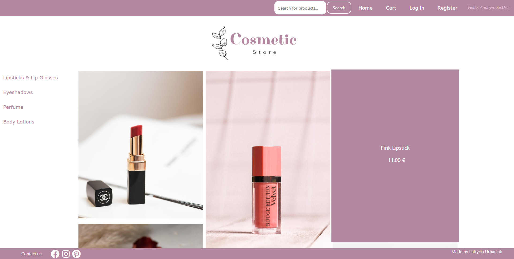

## E-Commerce Application using Python & Django
Hello! This is my first full e-commerce project!

## Web View
You can see the website on AWS with example data here: 
http://patrycja.urbaniak.cc/

Preview:

## Key features
As User (Public or Logged in)
- Viewing products
- Searching Products
- Creating an account
- Login/Logout
- Contact Form
- Cart (Adding to a cart and managing a cart)
- Changing password (as a logged in user)

As Admin
- Adding, deleting and updating products
- Managing users

## Frontend
- HTML 5
- CSS 3
- Javascript
- Bootstrap

## Backend
- Python 3 - Django 3
- SQL

## Before deployment
Change SECRET KEY, and DEBUG in beauty_supply_store/beauty_supply_store/settings.py for FALSE

## TO DO
- Checkout
- Creating and managing orders
- Checking if the amount of pieces of the product added to the cart is not greater than its quantity available in store
